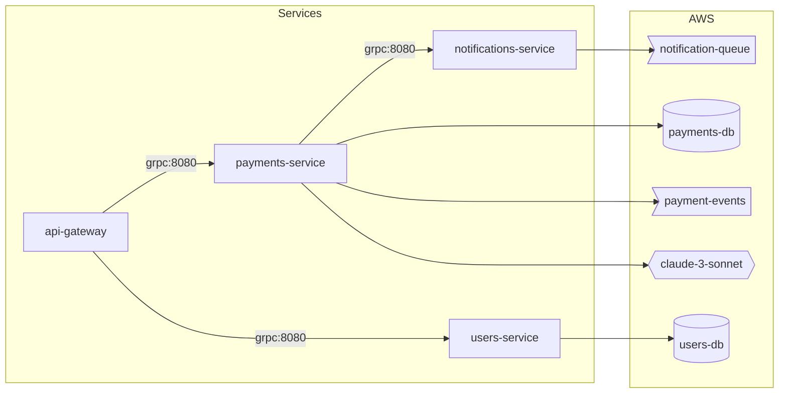

# Payments System Example

A complete example of a payments platform with microservices, AWS infrastructure, and deployment mappings.

## System Overview



## Full Specification

```json
{
  "name": "payments-platform",
  "description": "Payment processing system with microservices architecture",
  "version": "1.0.0",
  "services": {
    "api-gateway": {
      "description": "Public API gateway for payment processing",
      "repo": {
        "url": "https://github.com/plexusone/api-gateway",
        "ref": "main"
      },
      "image": {
        "name": "ghcr.io/plexusone/api-gateway",
        "tag": "v2.1.0"
      },
      "registry": "ghcr.io/plexusone",
      "exposes": [
        {"port": 443, "protocol": "https", "description": "Public HTTPS endpoint"}
      ],
      "connections": {
        "payments-service": {"port": 8080, "protocol": "grpc", "description": "Payment processing"},
        "users-service": {"port": 8080, "protocol": "grpc", "description": "User authentication"}
      },
      "cloudflare": {
        "zone": "api.payments.example.com"
      }
    },
    "payments-service": {
      "description": "Core payment processing service",
      "repo": {
        "url": "https://github.com/plexusone/payments-service",
        "ref": "main",
        "commit": "abc123def456"
      },
      "image": {
        "name": "ghcr.io/plexusone/payments-service",
        "digest": "sha256:a1b2c3d4e5f6"
      },
      "registry": "ghcr.io/plexusone",
      "exposes": [
        {"port": 8080, "protocol": "grpc"}
      ],
      "connections": {
        "notifications-service": {"port": 8080, "protocol": "grpc"}
      },
      "aws": {
        "rds": [
          {"name": "payments-db", "engine": "aurora-mysql", "port": 3306}
        ],
        "sqs": [
          {"name": "payment-events"}
        ],
        "bedrock": [
          {"modelId": "anthropic.claude-3-sonnet"}
        ],
        "vpc": "prod-vpc",
        "subnets": ["private-1a", "private-1b"],
        "securityGroups": ["payments-sg"]
      }
    },
    "users-service": {
      "description": "User management and authentication",
      "repo": {
        "url": "https://github.com/plexusone/users-service"
      },
      "image": {
        "name": "ghcr.io/plexusone/users-service",
        "tag": "v1.5.2"
      },
      "registry": "ghcr.io/plexusone",
      "exposes": [
        {"port": 8080, "protocol": "grpc"}
      ],
      "aws": {
        "rds": [
          {"name": "users-db", "engine": "postgres", "port": 5432}
        ],
        "dynamodb": [
          {"name": "user-sessions"}
        ]
      }
    },
    "notifications-service": {
      "description": "Email and push notification service",
      "repo": {
        "url": "https://github.com/plexusone/notifications-service"
      },
      "image": {
        "name": "ghcr.io/plexusone/notifications-service",
        "tag": "v1.2.0"
      },
      "registry": "ghcr.io/plexusone",
      "exposes": [
        {"port": 8080, "protocol": "grpc"}
      ],
      "aws": {
        "sqs": [
          {"name": "notification-queue"}
        ],
        "sns": [
          {"name": "alerts-topic"}
        ],
        "s3": [
          {"name": "email-templates"}
        ]
      }
    }
  },
  "deployments": {
    "helm": {
      "payments-chart": {
        "chart": "plexusone/payments",
        "version": "2.1.0",
        "repo": "https://charts.plexusone.io",
        "valuesFile": "values/prod.yaml",
        "services": ["api-gateway", "payments-service"]
      },
      "platform-chart": {
        "chart": "plexusone/platform",
        "version": "1.5.0",
        "repo": "https://charts.plexusone.io",
        "services": ["users-service", "notifications-service"]
      }
    },
    "terraform": {
      "aws-infra": {
        "source": "git::https://github.com/plexusone/terraform-aws-infra.git",
        "version": "v3.0.0",
        "resources": ["rds:payments-db", "rds:users-db", "sqs:payment-events"]
      }
    }
  }
}
```

## Key Features Demonstrated

### Container Image Pinning

```json
// Using digest for production stability
"image": {
  "name": "ghcr.io/plexusone/payments-service",
  "digest": "sha256:a1b2c3d4e5f6"
}

// Using tag for development
"image": {
  "name": "ghcr.io/plexusone/api-gateway",
  "tag": "v2.1.0"
}
```

### Git Commit Pinning

```json
"repo": {
  "url": "https://github.com/plexusone/payments-service",
  "ref": "main",
  "commit": "abc123def456"
}
```

### Service Connectivity

```json
"connections": {
  "payments-service": {
    "port": 8080,
    "protocol": "grpc",
    "description": "Payment processing"
  }
}
```

### AWS Resource Bindings

```json
"aws": {
  "rds": [{"name": "payments-db", "engine": "aurora-mysql"}],
  "sqs": [{"name": "payment-events"}],
  "bedrock": [{"modelId": "anthropic.claude-3-sonnet"}],
  "vpc": "prod-vpc",
  "securityGroups": ["payments-sg"]
}
```

### Deployment Mappings

```json
"deployments": {
  "helm": {
    "payments-chart": {
      "chart": "plexusone/payments",
      "services": ["api-gateway", "payments-service"]
    }
  },
  "terraform": {
    "aws-infra": {
      "source": "git::https://github.com/plexusone/terraform-aws-infra.git",
      "resources": ["rds:payments-db", "rds:users-db"]
    }
  }
}
```

## Rendering

```bash
# Validate
system-spec validate payments-system.json

# Render to D2
system-spec render payments-system.json --format d2 > payments.d2
d2 payments.d2 payments.svg

# Render to Mermaid
system-spec render payments-system.json --format mermaid
```
