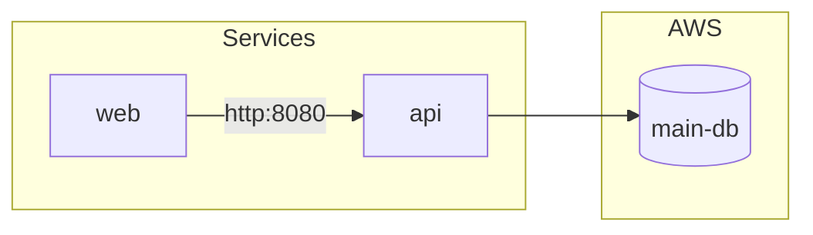

# Quick Start

## Create a System Spec

Create `system.json`:

```json
{
  "name": "my-system",
  "services": {
    "web": {
      "image": { "name": "nginx", "tag": "1.25" },
      "repo": { "url": "https://github.com/myorg/web" },
      "connections": {
        "api": { "port": 8080, "protocol": "http" }
      }
    },
    "api": {
      "image": { "name": "myorg/api", "tag": "v1.0" },
      "repo": { "url": "https://github.com/myorg/api" },
      "aws": {
        "rds": [{ "name": "main-db", "engine": "postgres" }]
      }
    }
  }
}
```

## Validate

```bash
system-spec validate system.json
```

Output:

```
valid: my-system (2 services)
  - web: nginx:1.25
      repo: https://github.com/myorg/web
      connections: 1
  - api: myorg/api:v1.0
      repo: https://github.com/myorg/api
```

## Render to D2

```bash
system-spec render system.json --format d2 > system.d2
```

Then generate an image:

```bash
d2 system.d2 system.svg
```

## Render to Mermaid

```bash
system-spec render system.json --format mermaid
```

Output (embed in Markdown):



## Use in Go

```go
package main

import (
    "fmt"
    "log"

    "github.com/plexusone/system-spec/spec"
    "github.com/plexusone/system-spec/graph"
    "github.com/plexusone/system-spec/render"
)

func main() {
    // Load system spec
    sys, err := spec.LoadFromFile("system.json")
    if err != nil {
        log.Fatal(err)
    }

    fmt.Printf("System: %s (%d services)\n", sys.Name, len(sys.Services))

    // Convert to graph
    g := graph.FromSystem(sys)
    fmt.Printf("Graph: %d nodes, %d edges\n", len(g.Nodes), len(g.Edges))

    // Render to D2
    renderers := render.NewRenderers()
    output, err := renderers.D2.Render(g)
    if err != nil {
        log.Fatal(err)
    }

    fmt.Println(string(output))
}
```

## Next Steps

- [CLI Reference](cli.md) - All CLI commands
- [Specification](../spec/v0.1.0.md) - Full spec documentation
- [Examples](../examples/payments.md) - Real-world examples
