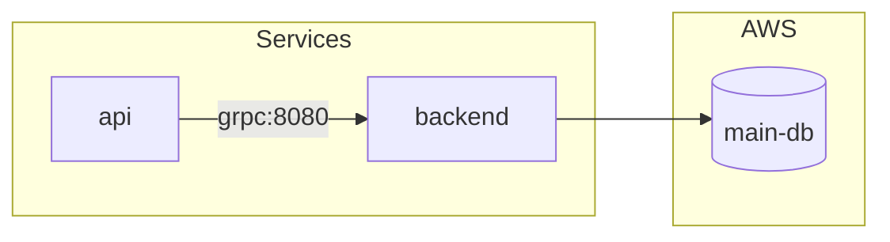
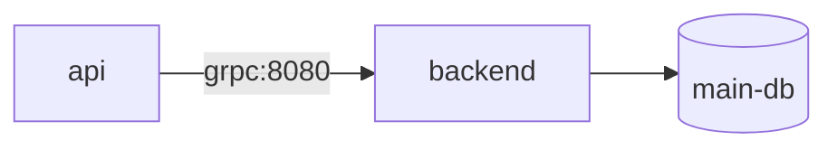

# Mermaid Renderer

[Mermaid](https://mermaid.js.org/) renders diagrams from text, with native GitHub support.

## Usage

=== "CLI"

    ```bash
    system-spec render system.json --format mermaid > system.mmd
    ```

=== "Go"

    ```go
    renderers := render.NewRenderers()
    output, err := renderers.Mermaid.Render(g)
    ```

## Output Example



## GitHub Integration

Embed directly in Markdown:

````markdown

````

## Node Shapes

| Kind | Syntax | Appearance |
|------|--------|------------|
| service | `[label]` | Rectangle |
| database | `[(label)]` | Cylinder |
| queue | `>label]` | Asymmetric |
| ai_model | `{{label}}` | Hexagon |
| helm/terraform | `[/label/]` | Parallelogram |

## Subgraphs

Services are grouped in a "Services" subgraph, and cloud resources are grouped by provider (AWS, GCP, etc.).

## Generating Images

```bash
# Using Mermaid CLI
npm install -g @mermaid-js/mermaid-cli
mmdc -i system.mmd -o system.svg
mmdc -i system.mmd -o system.png
```

## Customization

```go
renderer := render.NewMermaidRenderer()
renderer.Direction = "TB"  // "LR", "TB", "RL", "BT"
```
